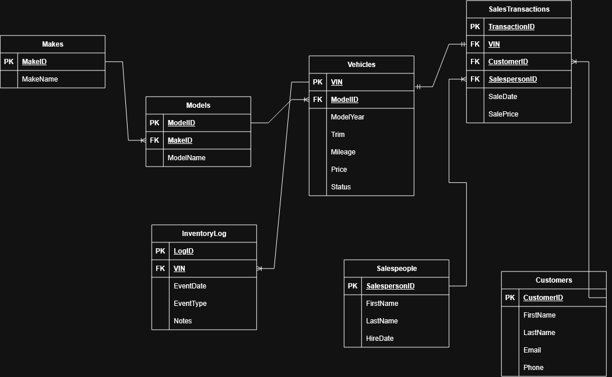
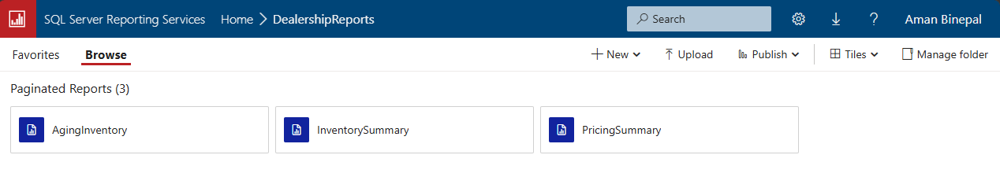
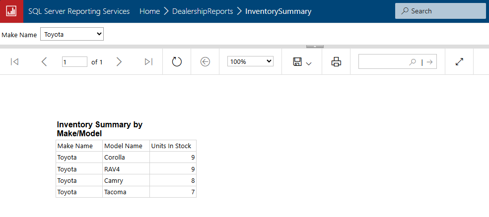
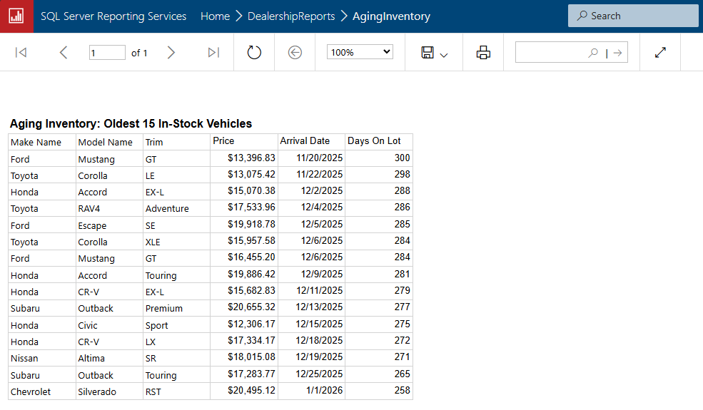

# dealership_inventory_sql
SQL Server / T-SQL relational database for car dealership inventory management, with an SSRS reporting layer.

## Overview

This project models a car dealership's inventory system end to end. It includes a normalized relational schema, synthetically generated realistic vehicle data, analytical SQL queries, and three SSRS reports built using that data. The reports were then deployed to a live report server.

## Tech stack

- SQL Server 2022 Express (T-SQL)
- SQL Server Management Studio (SSMS)
- SQL Server Reporting Services (SSRS)
- draw.io (ER diagram)

## Entity-relationship diagram

The `Vehicles -> SalesTransactions` relationship is one-to-one, not one-to-many like the rest of the schema. This is because a `VIN` can only be sold once. Everything else is a standard one-to-many relationship: `Makes -> Models -> Vehicles`, `Vehicles -> InventoryLog`, `Customers -> SalesTransactions`, and `Salespeople -> SalesTransactions`.

## Schema

Seven tables, in 3NF:

- **Makes**: vehicle manufacturers
- **Models**: models per make
- **Vehicles**: individual inventory units (VIN, year, trim, mileage, price, status)
- **Customers**
- **Salespeople**
- **SalesTransactions**: one row per completed sale
- **InventoryLog**: status and history trail per vehicle over time (arrivals, price changes, sales). This is what makes trend reports like "aging inventory" possible; `Vehicles` alone is just a current snapshot.

## Setup

1. Run `dealership_schema.sql` in SSMS to create the database and all seven tables
2. Run `dealership_seed_data.sql` to load sample inventory, customers, salespeople, and sales (generated synthetically with a fixed random seed for reproducibility, not scraped or real listings)
3. Run any of the queries in `analytics_queries.sql` to explore the data directly
4. The `.rdl` report files can be opened in Visual Studio with the Microsoft Reporting Services Projects extension, or viewed directly through a browser if deployed to an SSRS instance

## Analytics queries

`analytics_queries.sql` contains five queries:

1. Inventory count by make and model (In Stock only)
2. Average price and mileage by model (excludes Sold vehicles, since their listed price is no longer current)
3. Low-stock alert: models with fewer than 4 units currently In Stock
4. Sales performance by salesperson, including reps with zero sales
5. Aging inventory: the 15 longest-sitting In Stock vehicles, computed from InventoryLog arrival events

## Reports

Three SSRS reports, each built on one of the queries above:

- **InventorySummary**: inventory counts by make and model with a parameterized dropdown to filter to a single make (or "All")
- **PricingSummary**: average price and mileage by model with currency and number formatted
- **AgingInventory**: the 15 longest-sitting vehicles currently in stock

## Screenshots

### Reports deployed to the SSRS web portal

### Inventory Summary, filtered by make

### Aging Inventory

